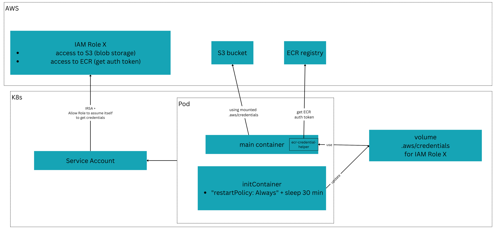

# Overview

This is a setup to use distribution/distribution Docker registry with S3 as storage and ECR as upstream registries.

Problem:
- Docker distribution `registry` doesn't support Web Identity federation (via IRSA) at the moment.
- Docker distribution supports only proxy auth via user/password or via docker-credential-helper. Use/password is not viable for production as ECR auth tokens (obtained via `aws ecr get-login-password`) expire in 12 hours.

Solution:
- The original chart wasn't modified, only the values file was changed. See [values-s3-ecr-proxy.yaml](values-s3-ecr-proxy.yaml).
- S3 cross-AZ costs are free as the registry returns pre-signed URLs to the client. No overhead on the registry to proxy the blobs data to the consumer (node).
- Uses a private ECR as upstream registry for the proxy.
- ECR authentication is only user/password or via docker-credential-helper. Use/password is not viable for production as tokens expire in 12 hours. Solution was using another custom image for the `registry:3.0.0` image, and using the `docker-credential-ecr-login` helper to get the auth token via the supported `proxy.exec.command` config data option. The original registry image `registry:3.0.0` wasn't modified, but instead used as base image.
- Uses Service NodePort to expose the registry to nodes. Nodes are the ones pulling the image and need to find a way to point to the registry service --> pods. Another solution would be using an ALB/NLB pointing to the registry service and use it in pod `spec.containers[].image` instead of localhost.




# Prerequisites

- AWS account for the cluster, S3 bucket and ECR repository.
- [eksctl](https://eksctl.io/installation/)
- docker/podman
- [helm](https://helm.sh/docs/intro/install/)
- [crane](https://github.com/google/go-containerregistry/blob/main/cmd/crane/README.md)

# Create Cluster

```
CLUSTER_NAME=eks-docker-registry-proxy-cache
eksctl create cluster --name $CLUSTER_NAME --region us-east-1 --node-type t3.small --nodes 3 --node-volume-size 20 --spot

# Create OIDC provider, needed for AWS IRSA authentication
eksctl utils associate-iam-oidc-provider --cluster $CLUSTER_NAME --approve
```

# Create IAM role for the registry

This IAM Role will be used by the init container to fetch AWS credentials and mount them in the registry container.

The role needs permissions to assume itself as it'll generate credentials that will be mounted in the registry container.
The reason is Web Identity federation is not supported by docker registry at the moment.

```bash
AWS_ACCOUNT_ID=281387974444
ROLE_NAME=DockerRegistryRole

# Get correct OIDC issuer (without https://)
OIDC_ISSUER=$(aws eks describe-cluster --name $CLUSTER_NAME --query "cluster.identity.oidc.issuer" --output text | sed 's|https://||')
AWS_ACCOUNT_ID=281387974444
# Recreate trust policy with correct issuer
cat > trust-policy.json << EOF
{
    "Version": "2012-10-17",
    "Statement": [
        {
            "Effect": "Allow",
            "Principal": {
                "Federated": "arn:aws:iam::${AWS_ACCOUNT_ID}:oidc-provider/${OIDC_ISSUER}"
            },
            "Action": "sts:AssumeRoleWithWebIdentity",
            "Condition": {
                "StringEquals": {
                    "${OIDC_ISSUER}:sub": "system:serviceaccount:docker-registry-proxy-cache:docker-registry-sa",
                    "${OIDC_ISSUER}:aud": "sts.amazonaws.com"
                }
            }
        }
    ]
}
EOF

# Recreate role
aws iam create-role --role-name $ROLE_NAME --assume-role-policy-document file://trust-policy.json

# Update policy to allow the role to assume itself
cat > trust-policy.json << EOF
{
    "Version": "2012-10-17",
    "Statement": [
        {
            "Effect": "Allow",
            "Principal": {
                "Federated": "arn:aws:iam::${AWS_ACCOUNT_ID}:oidc-provider/${OIDC_ISSUER}"
            },
            "Action": "sts:AssumeRoleWithWebIdentity",
            "Condition": {
                "StringEquals": {
                    "${OIDC_ISSUER}:sub": "system:serviceaccount:docker-registry-proxy-cache:docker-registry-sa",
                    "${OIDC_ISSUER}:aud": "sts.amazonaws.com"
                }
            }
        },
        {
            "Effect": "Allow",
            "Principal": {
                "AWS": "arn:aws:iam::${AWS_ACCOUNT_ID}:role/$ROLE_NAME"
            },
            "Action": "sts:AssumeRole"
        }
    ]
}
EOF

aws iam update-assume-role-policy --role-name $ROLE_NAME --policy-document file://trust-policy.json
```

# Create S3 bucket

1. Create bucket. Replace `BUCKET_NAME` with your bucket name.
```
AWS_BUCKET_NAME=registry-denisstorti
aws s3api create-bucket --bucket $AWS_BUCKET_NAME --region us-east-1
```

1. Set bucket policy to allow the IAM role for the registry to read and write to the bucket. Update `AWS_ACCOUNT_ID` with your AWS account ID.

```bash
AWS_ACCOUNT_ID=281387974444 # Update with your AWS account ID
ROLE_NAME=DockerRegistryRole

aws s3api put-bucket-policy --bucket $AWS_BUCKET_NAME --policy '{
    "Version": "2012-10-17",
    "Statement": [
        {
            "Effect": "Allow",
            "Principal": {
                "AWS": "arn:aws:iam::'$AWS_ACCOUNT_ID':role/'$ROLE_NAME'"
            },
            "Action": [
                "s3:ListBucket",
                "s3:GetBucketLocation",
                "s3:ListBucketMultipartUploads",
                "s3:GetObject",
                "s3:PutObject",
                "s3:DeleteObject",

                "s3:AbortMultipartUpload",
                "s3:ListMultipartUploadParts"
            ],
            "Resource": [
                "arn:aws:s3:::'$AWS_BUCKET_NAME'",
                "arn:aws:s3:::'$AWS_BUCKET_NAME'/*"
            ]
        }
    ]
}'

# Create policy for S3 access
cat > s3-registry-policy.json << EOF
{
    "Version": "2012-10-17",
    "Statement": [
        {
            "Effect": "Allow",
            "Action": [
                "s3:ListBucket",
                "s3:GetBucketLocation",
                "s3:ListBucketMultipartUploads"
            ],
            "Resource": "arn:aws:s3:::${AWS_BUCKET_NAME}"
        },
        {
            "Effect": "Allow",
            "Action": [
                "s3:GetObject",
                "s3:PutObject",
                "s3:DeleteObject",
                "s3:AbortMultipartUpload",
                "s3:ListMultipartUploadParts"
            ],
            "Resource": "arn:aws:s3:::${AWS_BUCKET_NAME}/*"
        }
    ]
}
EOF

aws iam create-policy \
    --policy-name DockerRegistryS3Policy \
    --policy-document file://s3-registry-policy.json

# Attach the policy to the role:
aws iam attach-role-policy --role-name $ROLE_NAME --policy-arn arn:aws:iam::${AWS_ACCOUNT_ID}:policy/DockerRegistryS3Policy
```

# Create policy for ECR access

Note: using `Resource": "*"` instead of `Resource": "arn:aws:ecr:*:${AWS_ACCOUNT_ID}:repository/*"` as `ecr:GetAuthorizationToken` needs it.

```bash
ROLE_NAME=DockerRegistryRole
AWS_ACCOUNT_ID=281387974444

cat > ecr-registry-policy.json << EOF
{
    "Version": "2012-10-17",
    "Statement": [
        {
            "Effect": "Allow",
            "Action": [
                "ecr:GetAuthorizationToken",
                "ecr:BatchCheckLayerAvailability",
                "ecr:GetDownloadUrlForLayer",
                "ecr:GetRepositoryPolicy",
                "ecr:DescribeRepositories",
                "ecr:ListImages",
                "ecr:BatchGetImage"
            ],
            "Resource": "*" 
        }
    ]
}
EOF

aws iam create-policy \
    --policy-name DockerRegistryECRPolicy \
    --policy-document file://ecr-registry-policy.json

# Attach the policy to the role:
aws iam attach-role-policy --role-name $ROLE_NAME --policy-arn arn:aws:iam::${AWS_ACCOUNT_ID}:policy/DockerRegistryECRPolicy
```


# Build Custom registry image with docker-credential-ecr-login helper

Let's build a custom registry image with the `docker-credential-ecr-login` helper.

```
docker build registry-ecr-image/ -t docker-registry-ecr-proxy:3.0.0
```

For working with EKS, you'll need to push that image to an accessible registry (eg. ECR, DockerHub, quay.io) to be able to pull it in EKS.

Just remember to set in values files `values-s3-ecr-proxy.yaml`:
- `image.repository` to the public registry image name.
- `image.tag` to the custom image tag.
- `image.pullPolicy` to `Always`.

# Configure Helm chart

Check the [values-s3-ecr-proxy.yaml](values-s3-ecr-proxy.yaml) file for lines with comment "MODIFIED" to understand what was changed. 

Update details to match your AWS region, AWS account ID, AWS IAM role name and ECR registry URL.

# Install Helm chart

Make sure to have AWS CLI credentials configured and update kube-config:

```bash
CLUSTER_NAME=eks-docker-registry-proxy-cache
aws eks update-kubeconfig --name $CLUSTER_NAME
```

Install helm chart: 
```bash
NAMESPACE=docker-registry-proxy-cache
helm install docker-registry . --namespace $NAMESPACE --create-namespace --values values-s3-ecr-proxy.yaml
```

# Validate installation

Push an image to the private ECR registry:
```bash
AWS_ACCOUNT_ID=281387974444
# Create ECR repository
aws ecr create-repository --repository-name nginx --region us-east-1

# Authenticate with ECR
aws ecr get-login-password --region us-east-1 | docker login --username AWS --password-stdin ${AWS_ACCOUNT_ID}.dkr.ecr.us-east-1.amazonaws.com

# Push image with crane (your use Docker tag + Docker push)
crane copy --platform linux/amd64 nginx:latest ${AWS_ACCOUNT_ID}.dkr.ecr.us-east-1.amazonaws.com/nginx:latest
```

Run a pod to pull the image from the private ECR registry through the proxy:
```bash
kubectl run -n $NAMESPACE --rm -it nginx --image localhost:30008/nginx:latest --restart Never sh

# Check if pod is Running or if there was a ImgPullErr
kubectl get pods -n $NAMESPACE nginx --watch
```

To confirm the image was cached in S3, check the S3 bucket.
It should contain a path similar to this `s3://<BUCKET_NAME>/docker/registry/v2/repositories/nginx/_manifests/tags/latest`, indicating the image was cached.

To confirm the cache is pulling from the private ECR, you can test a tag that only exists in Docker Hub and not in ECR, or you can push other custom tags to ECR only and run it in a pod to confirm the manifest for those custom tags are indeed coming from the private ECR.
```
crane copy --platform linux/amd64 nginx:latest 281387974444.dkr.ecr.us-east-1.amazonaws.com/nginx:v1

kubectl run -n $NAMESPACE --rm -it nginx --image localhost:30008/nginx:v1 --restart Never sh
```

# Clean up 

```
CLUSTER_NAME=eks-docker-registry-proxy-cache
AWS_ACCOUNT_ID=281387974444
ROLE_NAME=DockerRegistryRole

eksctl delete cluster --name $CLUSTER_NAME

# Detach policies from role
aws iam detach-role-policy --role-name $ROLE_NAME --policy-arn arn:aws:iam::${AWS_ACCOUNT_ID}:policy/DockerRegistryS3Policy
aws iam detach-role-policy --role-name $ROLE_NAME --policy-arn arn:aws:iam::${AWS_ACCOUNT_ID}:policy/DockerRegistryECRPolicy

# Delete role
aws iam delete-role --role-name $ROLE_NAME

# Delete policies
aws iam delete-policy --policy-arn arn:aws:iam::${AWS_ACCOUNT_ID}:policy/DockerRegistryS3Policy
aws iam delete-policy --policy-arn arn:aws:iam::${AWS_ACCOUNT_ID}:policy/DockerRegistryECRPolicy
# Bucket needs to be empty
aws s3api delete-bucket --bucket registry-denisstorti --region us-east-1
```
